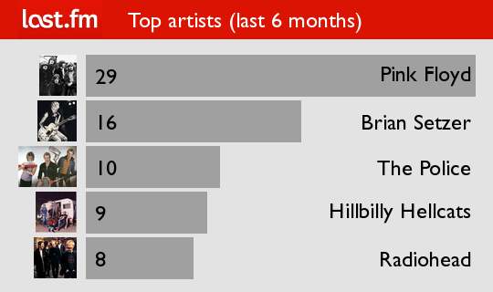

# last.fm-scripts
Python scripts for interacting with last.fm

I did these a few years ago to make a summary image of my last.fm listening habits, for putting on Tumblr or the like.

You'll need to add LASTFM_USER_NAME and LASTFM_API_KEY as environment variables (e.g. in .bash_profile). If you don't have either of these, you'll need to get them at [http://last.fm].

Running the script:

```
./lastfm.py
```

creates an image showing the top 5 artists listened over the last 6 months. Something like this (*NOTE: this may or may not represent my listening history*):



I need to add customization, etc. but it suits me for now.


